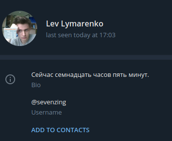
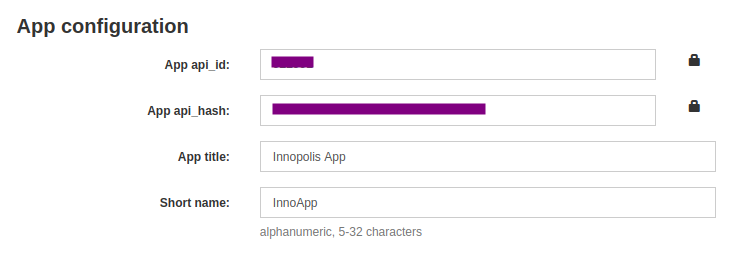

Time bio auto updater
===

## What does it do?
1. Update your bio every 30 second and set **current time** in words **in russian**:

    


2. Does not make you online always

## How to install?

1. You need your telegram `api_id` and `api_hash`. 
    
    + Create your telegram app [here](https://my.telegram.org/apps)
    + Copy hash and id: 
    
    + Do not share it to anyone!

2. Paste your cridentials in `cridentials.py`:
```python
    credentials = {    
    'api_id': <api_id>,
    'api_hash': '<api_hash>',
    'session': 'account0.session'   
}
```
3. Run the script using docker:

```bash
docker-compose up --build
```
